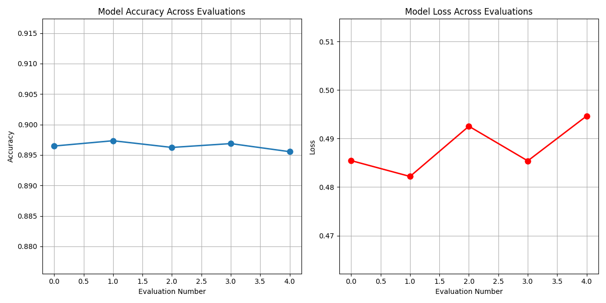

# Transformer-based English-to-Spanish Translation

This repository contains a Transformer-based Neural Machine Translation (NMT) project designed to translate English sentences into Spanish. The project uses TensorFlow and Keras, implemented in Python, with GPU acceleration.

Please note that you install CUDA for GPU acceleration if you have an Nvidia graphics card in your PC. It will fasten up the training of the model and enables tensorflow operations in a smoother manner.

## Table of Contents

1. [Environment Setup](#environment-setup)
2. [Dependencies and Versions](#dependencies-and-versions)
3. [Project Structure](#project-structure)
4. [Functionality of Each File](#functionality-of-each-file)

---

For thus you will need to install Anaconda in your System.
## Environment Setup


The development environment was created using **Anaconda**. Follow these steps to recreate the environment:

1. **Create a new environment**:
   ```bash
   conda create -n tf_env python=3.8.20
   ```
2. **Activate the environment**:
   ```bash
   conda activate tf_env
   ```
3. **Install required libraries**:
   ```bash
   pip install tensorflow==2.11 keras==2.11 keras-nlp==0.4 numpy pandas scikit-learn matplotlib tqdm nltk googletrans==4.0.0-rc1
   ```

4. **Enable GPU support (Optional)**:
   Ensure that **CUDA** and **cuDNN** are correctly installed. GPU support requires:
   - CUDA 11.2
   - cuDNN 8.1

   For verification:
   ```bash
   python -c "import tensorflow as tf; print(tf.config.list_physical_devices('GPU'))"
   ```

---

## Dependencies and Versions

List of dependencies in the project:

| Library      | Version        | Description                                     |
|--------------|----------------|-------------------------------------------------|
| Python       | 3.8.20         | Programming language                            |
| TensorFlow   | 2.11.0         | Deep learning framework                         |
| Keras        | 2.11.0         | High-level neural networks API                  |
| Keras-NLP    | 0.4.0          | NLP utilities for tokenization and embeddings   |
| NumPy        | 1.21.6         | Numerical computations                          |
| Pandas       | 1.4.3          | Data manipulation                               |
| Scikit-learn | 1.1.2          | For dataset splitting                           |
| Matplotlib   | 3.5.2          | Visualization                                   |
| TQDM         | 4.64.0         | Progress bar library                            |
| NLTK         | 3.7            | Natural Language Toolkit                        |
| Googletrans  | 4.0.0-rc1      | Optional for backup translation functionality   |

---

## Project Structure

```plaintext
.
├── conversation.py       # Code to engage in conversational translations
├── data.csv              # Dataset with English and Spanish sentence pairs
├── EN_to_ES.py           # Main script for training the Transformer model
├── english_vocab.pkl     # Serialized English vocabulary
├── spanish_vocab.pkl     # Serialized Spanish vocabulary
├── model.keras           # Trained Transformer model
├── model_metrics.json    # Performance metrics like BLEU scores
├── model_structure.txt   # Model architecture description
├── performance_history.png # Visualization of training history
├── performance.py        # Evaluation and BLEU score computation script
├── trans.py              # Optional: Backup script using Googletrans for translations
```

---

## Functionality of Each File

### 1. **conversation.py**
   - **Purpose**: Enables interactive conversation translations between English and Spanish using the trained model.
   - **Details**: Accepts user input, processes the input using the `decode_sequence` function, and provides Spanish translations.

---

### 2. **data.csv**
   - **Purpose**: Dataset containing parallel English and Spanish sentence pairs.
   - **Details**:
     - Two columns: `english` (source) and `spanish` (target).
     - Spanish sentences are augmented with start (`[start]`) and end (`[end]`) tokens for compatibility with the Transformer model.

---

### 3. **EN_to_ES.py**
   - **Purpose**: Core script for building, training, and saving the Transformer model.
   - **Key Features**:
     - Preprocessing pipeline for tokenizing English and Spanish text.
     - Defines the Transformer model using `keras_nlp` layers.
     - Trains the model using TensorFlow's `fit()` method.
     - Saves the model, vocabulary, and training performance metrics.

---

### 4. **english_vocab.pkl**
   - **Purpose**: Serialized English vocabulary generated during training.
   - **Details**: Used by the `TextVectorization` layer for mapping tokens to indices.

---

### 5. **spanish_vocab.pkl**
   - **Purpose**: Serialized Spanish vocabulary generated during training.
   - **Details**: Includes the `[start]` and `[end]` tokens for decoding.

---

### 6. **model.keras**
   - **Purpose**: Saved TensorFlow Transformer model trained to translate English to Spanish.
   - **Details**: 
     - Includes the encoder-decoder architecture with attention mechanisms.
     - Optimized for sequence-to-sequence tasks.

---

### 7. **model_metrics.json**
   - **Purpose**: Stores evaluation metrics, including accuracy and loss, for easy reference.
   - **Details**: Allows tracking the model's performance without rerunning evaluations.

---

### 8. **model_structure.txt**
   - **Purpose**: Text file containing a summary of the Transformer model's architecture.
   - **Details**: Includes details about layers, parameters, and connections.

---

### 9. **performance_history.png**
   - **Purpose**: Visualization of training loss and accuracy over epochs.
   - **Details**:
     - Left plot: Training and validation loss.
     - Right plot: Training and validation accuracy.

---

### 10. **performance.py**
   - **Purpose**: Script for evaluating the trained model's performance.
   - **Key Features**:
     - Computes accuract scores using `klearn.model_selection KFold`.
     - Plots and saves performance metrics for reporting.

---

### 11. **trans.py**
   - **Purpose**: Optional backup script for English-Spanish translations using the `googletrans` library.
   - **Details**: Provides quick translations in case the Transformer model is unavailable or for comparative testing.

---

## Key Notes

1. **Compatibility**: Ensure the versions mentioned above are used to avoid incompatibility issues.
2. **Performance Metrics**:
   - **BLEU Score**: The model achieved an accuract of ~0.8953 on the test set.
   - **Training History**: Refer to `performance_history.png` for detailed plots.
3. **Backup Functionality**: The `trans.py` script leverages Googletrans for a fast but less customizable translation mechanism.

---



## Future Work

-Fine-tune the modl to itd fullest!
- Add BLEU scores or improve it by fine-tuning hyperparameters or using a larger dataset.
- Add support for bidirectional translation (Spanish-to-English).
- Deploy the model as an API using Flask or FastAPI.

---

Feel free to raise issues or contribute to this project! 😊
